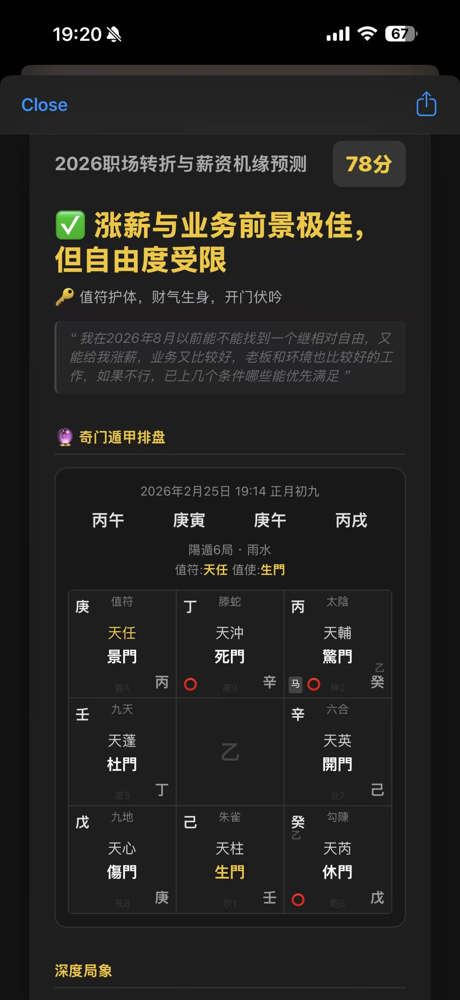
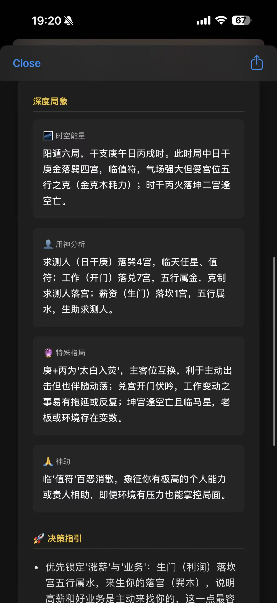
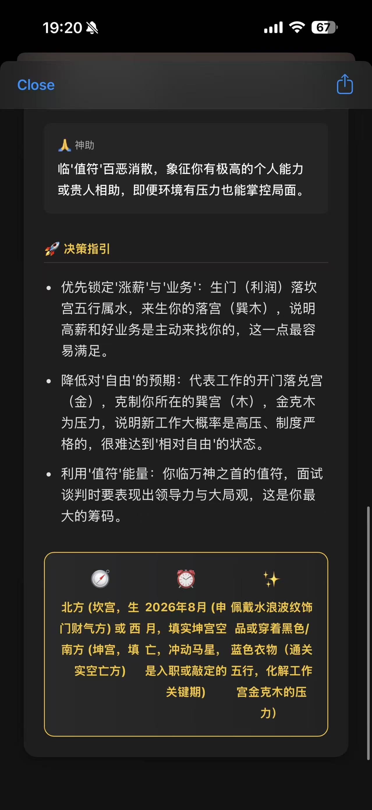

# 🧭 Qimen - 基于 AI 的奇门遁甲在线起局与决策引擎

> **结合传统术数与现代 AI 大语言模型，在 iOS 桌面打造你的私人决策智库。**

本项目是一个基于 iOS/iPadOS [Scriptable](https://scriptable.app/) 的自动化脚本集合。它利用“时家奇门拆补转盘法”进行高精度排盘，并无缝对接 Google Gemini 大语言模型，针对您的具体问题生成图文并茂、逻辑严密的决策指引卡片。

<table align="center">
  <tr>
    <td align="center">
      
    </td>
    <td align="center">
      
    </td>
    <td align="center">
      
    </td>
  </tr>
</table>

## ✨ 核心特性

- **🚀 一键起局与推演**：无需在多个 App 间来回切换，直接运行脚本并输入问题，瞬间生成涵盖九宫、神星门仪、马星、空亡、寄宫的全维度专业盘面。
- **🧠 深度 AI 解析**：原生对接 Gemini 模型，自动提取用神，精准分析五行生克与特殊格局，提供兼具易理支撑与同理心的策略建议及避坑指南。
- **🎨 极客风全屏 UI**：内置高度定制的 HTML 渲染引擎，生成黑金配色的沉浸式“赛博玄学”仪表盘，支持高亮值符/值使与各项关键神煞。
- **🔌 快捷指令原生 API**：提供专属的数据接口脚本，可无缝接入 iOS Shortcuts 自动化工作流，一键返回结构化的高阶排盘 JSON 数据。
- **🔒 绝对隐私安全**：API Key 采用 iOS 硬件级 Keychain (钥匙串) 进行本地加密存储，确保代码库与个人信息零泄露风险。
- **📦 历史归档系统**：每次推演后，自动在本地 iCloud Drive 生成带有时间戳的备份文件（JSON 格式），方便随时复盘与追溯。
- **🌐 智能网络适配**：原生支持切换 Gemini 官方直连接口或国内自定义代理/中继接口。

---

## 🛠️ 准备工作

1. **设备要求**：一台 iPhone 或 iPad。
2. **必备软件**：前往 App Store 免费下载 [Scriptable](https://apps.apple.com/app/scriptable/id1405459188)。
3. **获取 API Key**：前往 [Google AI Studio](https://aistudio.google.com/) 申请一个免费的 Gemini API Key。

---

## 📥 安装指南

1. 下载本仓库内的所有 `.js` 文件。
2. 将它们移动到您手机的 **iCloud Drive / Scriptable** 文件夹目录下。
3. *注意：首次运行主程序时，脚本会自动联网下载底层历法依赖库 `lunar-javascript`，请确保当前网络畅通。*

---

## 🚀 如何使用 (开箱即用模式)

这是最推荐的 All-in-One 体验模式：

1. 打开 Scriptable App，找到 `QimenOrchestrator` 脚本，点击运行（或将其添加为桌面小组件后点击运行）。
2. **首次配置**：系统将弹窗请求输入您的 Gemini API Key。该密钥将通过加密保存在本地（您也可以直接在脚本源码中进行硬编码配置）。
3. **输入问题**：在弹出的对话框中，输入您当下想要预测的具体事件（例如：“明天的大客户谈判能顺利拿下吗？”）。
4. **等待推演**：AI 将根据局象进行深度演算。视网络代理状况与接口响应速度，推演过程约需 30~300 秒，完成后将自动弹出精美的全屏决策卡片。

*(💡 提示：如需更改 API 代理地址，请直接在 `QimenOrchestrator.js` 文件顶部修改 `API_URL` 变量。)*

---

## 🔗 进阶用法 (接入 iOS 快捷指令)

对于喜欢自定义自动化工作流的高阶玩家，本项目提供了 `QimenShortcutsAPI.js` 作为轻量级的本地数据接口。

1. 在 iOS 快捷指令中添加 **“运行脚本 (Run Script)”** 操作，选择 `QimenShortcutsAPI`。
2. **可选传参**：可通过快捷指令的“文本”模块传入特定时间（格式：`YYYY-MM-DD-HH-mm`）进行指定时间的起局；若不传参，则默认使用当前系统时间。
3. **输出结果**：该脚本将返回一个完美格式化的 JSON 文本，包含四柱、神煞（含日/时空亡与马星）、局数信息及九宫详细飞布（含寄宫逻辑），您可以利用这些数据喂给其他大模型或进行二次应用开发。

  
{
  "status": "success",
  "pillars": {
    "hour": "辛巳",
    "month": "己丑",
    "day": "乙未",
    "year": "乙巳"
  },
  "timestamp": {
    "solar": "2026年1月21日 10:27",
    "lunar": "腊月初三"
  },
  "ju_info": {
    "zhi_fu": "天輔",
    "zhi_fu_palace": "落乾6宫",
    "zhi_shi_palace": "落坤2宫",
    "jieqi": "大寒",
    "yuan": "上元",
    "zhi_shi": "杜門",
    "name": "陽遁3局",
    "xun_shou": "甲戌己"
  },
  "auxiliary": {
    "ma_xing": {
      "day": "巳",
      "hour": "亥"
    },
    "kong_wang": {
      "day": "辰巳",
      "hour": "申酉"
    }
  },
  "palaces": [
    {
      "star": "天心",
      "sky": "辛",
      "ji_sky": "",
      "door": "生門",
      "kong_wang": {
        "day": true,
        "is_kong": true,
        "hour": false
      },
      "god": "勾陳",
      "earth": "己",
      "ji_earth": "",
      "ma_xing": {
        "day": true,
        "has_ma": true,
        "hour": false
      },
      "name": "巽4宫",
      "index": 0
    } //省略其他8个宫位信息
    
  ]
}

---

## 📂 文件结构说明

- `QimenOrchestrator.js`：**核心入口**。负责获取输入、调度起局、组装 Prompt、请求 AI、存盘及渲染 HTML 前端。
- `QimenCalculations.js`：包含奇门遁甲的核心推演逻辑（天地盘、九星八门八神飞布）。
- `QimenConstants.js`：静态数据字典（二十四节气局数、洛书轨迹等）。
- `QimenUtils.js`：抽象的数组旋转、干支提取等数学工具函数。
- `QimenShortcutsAPI.js`：快捷指令接口。专为 iOS Shortcuts 设计的结构化 JSON 数据输出模块，方便高阶用户进行自动化串联。

---

## 🙏 鸣谢 (Acknowledgments)

- 底层干支与节气计算强依赖于优秀的开源日历库：[lunar-javascript](https://github.com/6tail/lunar-javascript) 
- 感谢 Google Gemini 提供强大的多模态解析能力。

---

## 📄 开源协议

本项目基于 **MIT License** 开源。您可以自由使用、修改和分发，但请保留原作者声明。玄学推演结果仅供参考，请理性决策。
