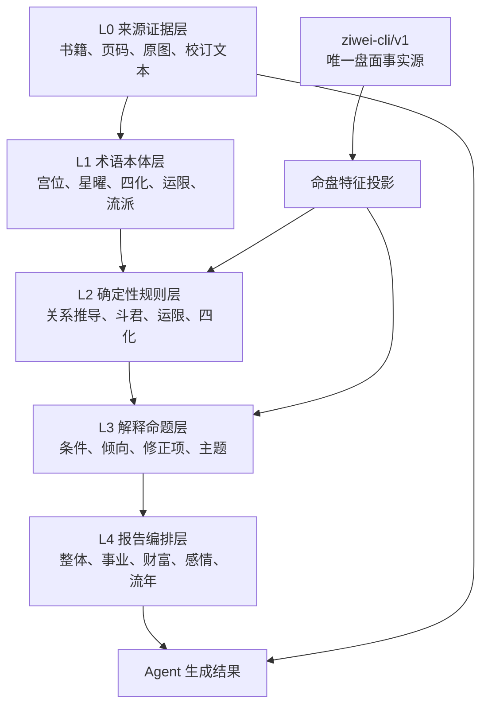

# 紫微斗数知识库与规则提取 Implementation Plan

> **For agentic workers:** REQUIRED SUB-SKILL: Use superpowers:subagent-driven-development (recommended) or superpowers:executing-plans to implement this plan task-by-task. Steps use checkbox (`- [ ]`) syntax for tracking.

**Goal:** 将两本紫微斗数资料转换为可追溯、可审核、可执行、可供 Agent 检索的规则与解释知识，并与现有 `ziwei-cli/v1` 命盘输出稳定衔接。

**Architecture:** 现有 CLI 和 `iztro@2.5.8` 继续作为唯一排盘事实源；书籍内容按“来源证据、术语本体、确定性推导规则、解释命题、报告编排”分层。公式类知识由规则引擎执行，解释类知识通过结构化条件过滤和混合检索供 Agent 使用，LLM 只组织语言，不重新排盘或自行发明规则。

**Tech Stack:** Node.js/CommonJS、JSON Schema、YAML/JSONL、Ajv、现有 `ziwei-cli/v1`、SQLite FTS 或等价全文索引、可选向量索引。

---

## 1. 架构决策

### 1.1 五层知识模型



| 层级 | 内容 | 是否可直接参与计算 | 主要消费者 |
| --- | --- | --- | --- |
| L0 来源证据 | 书名、版本、PDF 页、印刷页、原图定位、校订文本 | 否 | 审核人员、证据追溯 |
| L1 术语本体 | 星曜、宫名、别名、流派、作用域和主题枚举 | 否 | 提取器、规则校验器、检索器 |
| L2 确定性规则 | 三方四正、同宫会照、流年斗君、运限层级等 | 是 | 规则引擎 |
| L3 解释命题 | 某星在某宫、化曜、煞曜修正后的结构倾向 | 条件匹配，不做排盘 | 检索器、Agent |
| L4 报告编排 | 不同问事主题的阅读顺序、证据排序、冲突处理 | 是，限编排 | 报告生成器 |

### 1.2 知识与程序的边界

- CLI 输出是 `chart facts`：十二宫、星曜、庙旺、四化、大限和运限快照。
- 规则引擎输出是 `derived facts`：三方四正、星曜组合、被四化引动的宫位、重复引动层级。
- 解释知识输出是 `interpretation propositions`：结构可能代表什么、成立条件、减弱条件和适用主题。
- Agent 输出是 `narrative`：把已命中的事实和命题组织成自然语言。
- Agent 不允许重新安星、不允许更改宫位、不允许根据口诀覆盖 CLI 盘面。
- 健康、法律、财务、死亡和犯罪等高风险断语不得作为确定结论；只能在经过安全审核后转成条件性提醒。

### 1.3 流派隔离

第一版采用以下命名空间，不把不同口径静默混合：

| 命名空间 | 作用 |
| --- | --- |
| `iztro-default` | 当前排盘口径和 CLI 事实 |
| `sanhe-core` | 命身、三方四正、星情和宫位分析 |
| `feixing-aux` | 生年/宫干/运限四化的辅助观察 |
| `classical-reference` | 古籍规则和历史断语，仅供校验与研究 |

每条规则必须声明 `school`。当解释请求没有指定流派时，默认执行 `sanhe-core`，再附加不冲突的 `feixing-aux`；`classical-reference` 不自动进入用户结论。

## 2. 推荐目录

```text
knowledge/ziwei/
  README.md
  schemas/
    source.schema.json
    rule.schema.json
    interpretation.schema.json
    report.schema.json
  ontology/
    palaces.yaml
    stars.yaml
    transformations.yaml
    topics.yaml
    schools.yaml
    aliases.yaml
  sources/
    catalog.yaml
    mingli-tianji/
      page-map.jsonl
      excerpts.jsonl
    feixing-ziwei/
      page-map.jsonl
      excerpts.jsonl
  rules/
    calculation/
    relation/
    activation/
    composition/
  interpretations/
    palaces/
    stars/
    combinations/
    transformations/
    periods/
  policies/
    safety.yaml
    conflict-resolution.yaml
  reports/
    overall.yaml
    career.yaml
    wealth.yaml
    relationship.yaml
    annual.yaml
  fixtures/
    rule-cases/
    report-cases/
scripts/
  ziwei_knowledge_validate.cjs
  ziwei_rule_extract.cjs
  ziwei_rule_compile.cjs
  ziwei_rule_eval.cjs
```

完整 PDF、页面图片和整书 OCR 不提交 Git。仓库只保存来源目录、页码映射、必要的短摘录、校订后的规则和解释命题；原始文件保留在受控资料目录或对象存储中。

## 3. 核心数据规格

### 3.1 来源证据 `SourceExcerpt`

```yaml
id: source.mingli-tianji.p408.doujun
source_id: mingli-tianji
title: 流年斗君法
pdf_page: 421
printed_page: 408
section: 第四章 流年斗君、流月、流日、流时
text: 从流年所在宫起正月，逆数至生月，再顺数生时
ocr_status: visually_verified
content_hash: sha256:...
```

`text` 只保存支持该条规则所需的最短摘录。OCR 原文与人工校订文必须分字段保存，避免把校订内容伪装成原文。

### 3.2 原子规则 `ZiweiRule`

```yaml
id: rule.flow.doujun.v1
name: 流年斗君定位
rule_type: calculation
school: sanhe-core
scope: yearly
status: reviewed
priority: 100
inputs:
  - yearly_palace_branch
  - lunar_birth_month
  - birth_time_index
when:
  all:
    - fact: lunar_birth_month
      operator: between
      value: [1, 12]
derive:
  fact: yearly_doujun_palace_branch
  operator: palace_offset
  arguments:
    start: yearly_palace_branch
    reverse_steps: lunar_birth_month_minus_one
    forward_steps: birth_time_index
evidence:
  - source.mingli-tianji.p408.doujun
  - source.feixing-ziwei.p127.doujun
confidence: high
risk: low
```

规则条件采用受限 DSL，不允许在 YAML 中嵌入任意 JavaScript。第一版只实现 `equals`、`contains`、`all`、`any`、`not`、`between`、`palace_offset`、`same_palace`、`opposite`、`trine` 和 `has_mutagen`。

### 3.3 解释命题 `InterpretationProposition`

```yaml
id: interp.career.wuqu.lu.v1
title: 武曲化禄与事业资源
school: sanhe-core
scope: natal
topics: [career, wealth]
subject:
  palace: 官禄宫
conditions:
  all:
    - feature: palace_has_star
      palace: 官禄宫
      star: 武曲
    - feature: star_has_mutagen
      star: 武曲
      mutagen: 禄
claim:
  tendency: 资源管理、执行和经营能力更容易成为事业优势
  strength: medium
modifiers:
  strengthen:
    - 禄权科会照
  weaken:
    - 煞忌集中且大限重复引动
language_policy:
  deterministic: false
  forbidden_phrases: [必然发财, 注定富贵]
evidence:
  - source.mingli-tianji.example
confidence: medium
```

解释命题必须包含成立条件、增强项、减弱项、证据和非确定性表达策略。没有条件的孤立断语不进入正式库。

### 3.4 命中结果 `RuleMatch`

```json
{
  "rule_id": "interp.career.wuqu.lu.v1",
  "topic": "career",
  "scope": "natal",
  "matched_facts": [
    "官禄宫含武曲",
    "武曲生年化禄"
  ],
  "strength": 0.72,
  "evidence_ids": [
    "source.mingli-tianji.example"
  ],
  "conflicts": [],
  "warnings": []
}
```

Agent 只能使用 `RuleMatch` 中实际命中的事实生成结论。没有 `matched_facts` 的检索结果只能作为背景知识，不能写成针对用户命盘的判断。

## 4. 规则分类

首批提取按以下顺序进行：

| 优先级 | 类别 | 示例 | 处理方式 |
| ---: | --- | --- | --- |
| P0 | 术语与同义词 | 官禄宫/事业宫、仆役宫/交友宫 | 人工校订 |
| P0 | 可验证公式 | 斗君、流月、流日、流时 | 双来源核对后转规则 |
| P0 | 固定关系 | 本宫、对宫、三方四正 | 与 CLI fixture 自动验证 |
| P1 | 分析顺序 | 命宫→福德→迁移→财帛/官禄 | 转报告编排规则 |
| P1 | 四化作用域 | 生年、大限、流年、流月、流日、流时 | 转 activation 规则 |
| P1 | 星曜基础语义 | 十四主星在十二宫的结构意义 | 转解释命题 |
| P2 | 组合修正 | 吉曜、煞曜、庙旺、化忌会照 | 条件化命题 |
| P2 | 运限叠加 | 本命、大限、流年重复引动 | 转 composition 规则 |
| P3 | 古籍格局 | 富贵贫贱、特殊格局 | 先进入历史参考 |
| 禁止自动发布 | 高风险事件 | 疾病、死亡、犯罪、灾难、性行为 | 安全审核或排除 |

## 5. 提取与审核流水线


状态只能按以下方向推进：

```text
draft_ocr
  → extracted
  → visually_verified
  → cross_checked
  → reviewed
  → deprecated
```

任何 `draft_ocr` 或 `extracted` 内容不得被线上 Agent 检索。存在流派冲突时，不强行合并，而是保留两个带命名空间的规则版本，并记录 `conflicts_with`。

## 6. 运行时链路

1. 调用现有 `scripts/ziwei_cli.cjs` 获得 `ziwei-cli/v1`。
2. 将盘面投影为稳定特征，例如：
   - `palace_has_star(命宫, 紫微)`
   - `star_has_mutagen(武曲, 禄)`
   - `palace_trine(命宫, 财帛宫)`
   - `period_activates(流年, 官禄宫)`
3. 执行 L2 规则，生成关系、组合和运限叠加事实。
4. 按用户主题、流派、作用域、宫位和命中星曜做结构化过滤。
5. 对通过过滤的解释命题做全文/向量混合检索。
6. 执行冲突消解：
   - 精确组合优先于单星解释；
   - 运限引动只能修改时间范围，不能重写本命结构；
   - 庙旺、四化和煞曜作为增强/减弱项；
   - 高证据等级优先；
   - 不同流派并列呈现，不伪装成单一结论。
7. Agent 按报告模板生成“结论—盘面证据—条件—建议—来源”。
8. 输出校验器检查每个针对性结论是否至少有一个 `matched_fact` 和一个正式证据。

## 7. 检索策略

第一版不需要图数据库。规则关系已经由结构化字段表达，建议采用：

- 第一阶段：按 `school`、`scope`、`topics`、`palace`、`stars`、`mutagens` 精确过滤；
- 第二阶段：SQLite FTS/BM25 检索标题、别名和校订文本；
- 第三阶段：只对解释命题使用向量召回；
- 最终排序：命中条件完整度 > 证据等级 > 规则优先级 > 语义相似度。

禁止直接用用户问题在整书 OCR 上做纯向量检索后生成结论。整书 OCR 仅用于提取和人工追溯。

## 8. 两本书的分工

### 《命理天机：紫微斗数规则的运用与分析》

优先提取：

- 章节术语和分析次序；
- 十二宫主题；
- 十四主星及常用辅煞语义；
- 三方四正与四化修正；
- 本命、大限、流年、流月、流日和流时的层级；
- 有明确条件的组合解释。

它是第一版解释库和报告编排的主要来源，但具体事件断语必须降级。

### 《飞星紫微斗数》

优先提取：

- 斗君、大小限、十二神等公式；
- 四化、庙旺和生克制化的古法口径；
- 可与 CLI 或现代资料对照的安星规则；
- 可构建黄金案例的明确口诀。

它主要作为古法校验和流派差异来源，不直接充当现代解释模板。作者归属、版本和古籍传承信息作为书目元数据记录，不视为算法正确性的证明。

## 9. 第一批可交付范围

第一批只做 30～50 条高价值规则，不追求整书覆盖：

- 12 宫标准名、别名和主题；
- 三方四正、对宫、同宫关系；
- 十天干四化表的版本记录与 CLI 对照；
- 流年斗君、流月、流日、流时；
- 本命—大限—流年—流月—流日—流时的作用域；
- 命宫、身宫、福德、迁移、财帛、官禄的基础分析顺序；
- 14 主星的基础语义骨架；
- 5～10 条明确的增强/减弱修正规则；
- 安全策略和禁止自动发布类别。

验收标准：

- 每条正式规则都有稳定 ID、流派、作用域、条件、结果和证据；
- 每条公式完成原页复核，关键公式至少有两个来源或一个来源加 CLI 对照；
- `reviewed` 规则通过 JSON Schema；
- 规则运行不修改 CLI 原始盘面；
- 相同输入重复运行得到相同 `RuleMatch`；
- 报告中的针对性结论均能追溯到盘面事实和来源。

## 10. 实施任务

### Task 1: 建立知识本体与 Schema

**Files:**
- Create: `knowledge/ziwei/README.md`
- Create: `knowledge/ziwei/schemas/source.schema.json`
- Create: `knowledge/ziwei/schemas/rule.schema.json`
- Create: `knowledge/ziwei/schemas/interpretation.schema.json`
- Create: `knowledge/ziwei/ontology/palaces.yaml`
- Create: `knowledge/ziwei/ontology/schools.yaml`
- Test: `scripts/ziwei_knowledge_validate.test.cjs`

- [x] **Step 1: 为来源、规则和解释命题写失败的 Schema 验证测试**
- [x] **Step 2: 运行 `node --test scripts/ziwei_knowledge_validate.test.cjs`，确认因 Schema 不存在而失败**
- [x] **Step 3: 实现三个 JSON Schema 和宫位/流派枚举**
- [x] **Step 4: 再次运行测试，确认合法 fixture 通过、缺少证据或流派的 fixture 失败**
- [x] **Step 5: 提交 `feat(ziwei): add knowledge schemas and ontology`**

### Task 2: 建立来源目录与页码映射

**Files:**
- Create: `knowledge/ziwei/sources/catalog.yaml`
- Create: `knowledge/ziwei/sources/mingli-tianji/page-map.jsonl`
- Create: `knowledge/ziwei/sources/feixing-ziwei/page-map.jsonl`
- Create: `knowledge/ziwei/sources/mingli-tianji/excerpts.jsonl`
- Create: `knowledge/ziwei/sources/feixing-ziwei/excerpts.jsonl`
- Test: `scripts/ziwei_source_catalog.test.cjs`

- [ ] **Step 1: 写测试验证书目 ID、PDF 页、印刷页和 OCR 状态**
- [ ] **Step 2: 运行测试，确认空目录无法通过**
- [ ] **Step 3: 登记两本书及首批规则涉及页面**
- [ ] **Step 4: 只录入支撑首批规则所需的最短校订摘录**
- [ ] **Step 5: 运行测试并提交 `docs(ziwei): catalog rule sources and page mappings`**

### Task 3: 提取 P0 确定性规则

**Files:**
- Create: `knowledge/ziwei/rules/relation/palace-relations.yaml`
- Create: `knowledge/ziwei/rules/calculation/doujun.yaml`
- Create: `knowledge/ziwei/rules/calculation/flow-periods.yaml`
- Create: `knowledge/ziwei/rules/activation/period-scopes.yaml`
- Test: `knowledge/ziwei/fixtures/rule-cases/p0-rules.json`

- [ ] **Step 1: 写斗君、流月/流日/流时、三方四正的期望 fixture**
- [ ] **Step 2: 将书中候选规则以 `extracted` 状态录入**
- [ ] **Step 3: 对照原页，将通过视觉复核的规则提升为 `visually_verified`**
- [ ] **Step 4: 用第二本书或 CLI 对照完成交叉验证**
- [ ] **Step 5: 将无冲突规则提升为 `reviewed` 并提交 `feat(ziwei): add verified foundational rules`**

### Task 4: 建立规则编译与执行器

**Files:**
- Create: `scripts/ziwei_rule_compile.cjs`
- Create: `scripts/ziwei_rule_eval.cjs`
- Create: `scripts/ziwei_rule_eval.test.cjs`
- Create: `knowledge/ziwei/dist/.gitkeep`

- [ ] **Step 1: 写失败测试，覆盖受限操作符、未知操作符拒绝和稳定输出**
- [ ] **Step 2: 运行测试，确认编译器和执行器尚不存在**
- [ ] **Step 3: 实现 YAML 到规范 JSON 的编译及 Schema 校验**
- [ ] **Step 4: 实现白名单操作符，不执行任意代码**
- [ ] **Step 5: 对同一 CLI fixture 连续执行两次，断言 `RuleMatch` 完全一致**
- [ ] **Step 6: 提交 `feat(ziwei): compile and evaluate structured rules`**

### Task 5: 建立第一批解释命题

**Files:**
- Create: `knowledge/ziwei/interpretations/palaces/core-palaces.yaml`
- Create: `knowledge/ziwei/interpretations/stars/major-stars.yaml`
- Create: `knowledge/ziwei/interpretations/transformations/core-mutagens.yaml`
- Create: `knowledge/ziwei/policies/safety.yaml`
- Test: `knowledge/ziwei/fixtures/report-cases/core-interpretations.json`

- [ ] **Step 1: 写命宫、官禄、财帛等主题的命中与不命中 fixture**
- [ ] **Step 2: 提取十四主星的中性基础语义，每条声明增强和减弱项**
- [ ] **Step 3: 将确定性、高风险和性别刻板断语标为禁止发布**
- [ ] **Step 4: 运行 Schema 与 fixture 测试**
- [ ] **Step 5: 提交 `feat(ziwei): add reviewed interpretation propositions`**

### Task 6: 建立报告编排与证据校验

**Files:**
- Create: `knowledge/ziwei/reports/overall.yaml`
- Create: `knowledge/ziwei/reports/career.yaml`
- Create: `knowledge/ziwei/reports/wealth.yaml`
- Create: `knowledge/ziwei/reports/relationship.yaml`
- Create: `knowledge/ziwei/reports/annual.yaml`
- Create: `scripts/ziwei_report_evidence.test.cjs`

- [ ] **Step 1: 写失败测试，要求针对性结论同时包含盘面事实和来源 ID**
- [ ] **Step 2: 定义各主题的宫位优先级和阅读顺序**
- [ ] **Step 3: 实现报告输出证据校验**
- [ ] **Step 4: 验证没有证据的结论被拒绝，高风险文案被安全策略阻止**
- [ ] **Step 5: 提交 `feat(ziwei): add evidence-backed report composition`**

### Task 7: 建立回归基线

**Files:**
- Create: `knowledge/ziwei/fixtures/rule-cases/README.md`
- Create: `scripts/eval-ziwei-knowledge.cjs`
- Modify: `package.json`

- [ ] **Step 1: 收录虚构或公开命例，不使用真实用户身份资料**
- [ ] **Step 2: 为 P0/P1 规则定义命中率、冲突率、无证据结论数**
- [ ] **Step 3: 增加 `npm run test:ziwei-knowledge`**
- [ ] **Step 4: 运行 CLI 测试、知识 Schema 测试和知识回归**
- [ ] **Step 5: 记录首个基线并提交 `test(ziwei): establish knowledge regression baseline`**

## 11. 完成标准

方案完成不等于整书数字化。第一阶段完成的判断标准是：

- 两本书的首批来源页可追溯；
- 30～50 条规则达到 `reviewed`；
- 确定性规则可以在 CLI JSON 上重复执行；
- 解释命题能够按主题和盘面事实准确召回；
- Agent 不能引用未命中的命题；
- 高风险断语被策略层拦截；
- 每个用户结论均能说明“盘面依据、规则依据、适用条件和不确定性”。
