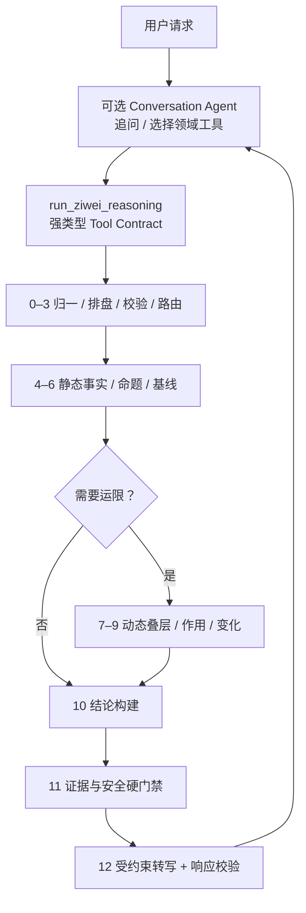

# PRD：紫微斗数正向推理 Pipeline

## 1. Introduction / Overview

本产品在现有 `ziwei-cli/v1`、紫微知识库、规则求值器和证据报告组装器之上，新增一条“事实先行、规则推导、动态叠层、状态变化、语言表达”的正向推理 Pipeline。

用户提供档案和问题后，系统不让 LLM 直接解释整张命盘，而是先由确定性模块完成：

1. 生成并校验命盘事实；
2. 建立本命静态基线；
3. 按主题展开目标宫位和关系宫位；
4. 匹配已经审核且有原书证据的解释命题；
5. 按需叠加大限、流年；
6. 识别动态层对本命结构的作用点；
7. 比较作用前后的状态变化；
8. 生成带事实、规则、来源和限制的结论单元；
9. 最后才允许 LLM 把结论单元转写成用户可读文本。

默认产品口径：

- 交付形态：后端 Pipeline/API，复用现有 CLI；
- 流派：`sanhe-core` 为主体，`feixing-aux` 为辅助；
- 输出：结构解读、动态变化和逐条证据链；
- 首期时间范围：本命、大限、流年；
- 未命中已审核命题时不补写结论。

## 2. 产品原则

### 2.1 确定性优先

排盘事实、宫位关系、运限重排、规则命中和证据绑定都必须由代码完成。LLM 只负责表达，不参与安星、改盘、计算四化或补造规则。

### 2.2 静态基线先于动态判断

动态层不能独立下结论。系统必须先生成本命主题的静态状态，再说明大限、流年对该状态产生了增强、削弱、转向、冲突或无明显变化。

### 2.3 来源门禁

线上结论必须同时满足：

- 命盘事实真实命中；
- 解释命题状态为 `reviewed`；
- 命题绑定至少一个视觉复核过的来源；
- 规则适用流派和当前产品流派一致；
- 未被安全策略拦截。

### 2.4 流派隔离

`sanhe-core`、`feixing-aux` 和 `classical-reference` 分开求值。辅助流派只能补充观察，不能静默覆盖主体流派结论。冲突必须作为显式结果返回。

### 2.5 可重放和可审计

相同输入、引擎版本、知识库版本和 Pipeline 版本应得到相同的结构化推理结果。每个结论必须能追溯到命盘事实、规则或命题、来源页码和版本。

### 2.6 受控灵活性

是否使用 LLM 与是否采用 Agent 是两件事。线上核心的执行顺序、工具选择和停止条件必须由代码控制；LLM 只允许出现在自然语言参数提取、歧义路由和结论转写三个受约束节点。任何模型输出都必须符合固定 Schema，并由确定性代码复核。

## 3. 理论依据与产品映射

| 原始依据 | 来源位置 | 产品映射 |
| --- | --- | --- |
| 先看命宫、福德宫、迁移宫、财帛宫、官禄宫，再看其余宫位 | 《命理天机》原书第416页 | 静态基线读取顺序 |
| 判断宫位需要联看本宫、对宫、三方和邻宫 | 《命理天机》原书第416页；《飞星紫微斗数》第250页 | 主题宫位关系图 |
| 星曜、四化不能脱离落宫、庙旺和会照条件 | 《命理天机》第416页；《飞星紫微斗数》第249—250页 | 条件命题和修正项 |
| 大限、流年分别重立命宫并重新分析十二宫 | 《命理天机》第417页 | 动态 Overlay |
| 不同时间层四化有不同主要作用范围 | 《命理天机》第409页 | 时间层作用域 |
| 原局为静、运限为动，外因通过内因作用 | 陆致极《八字命理动态分析教程》第83—87、251页起 | 仅作为“静态基线—动态触发—状态变化”的方法框架 |

陆致极教材中的八字“应局”“原身和禄引动”不进入紫微规则库。紫微的动态连接只允许使用紫微来源支持的宫位重叠、对宫、三方、四化和时间层关系。

## 4. 用户体验

### 4.1 用户输入

用户只需要提供：

- 已授权的 `profile_id`；
- 主题：整体、事业、财富或关系；
- 可选问题文本；
- 时间范围：本命、大限、流年或跨层分析；
- 可选报告预设：标准报告或流年总览；
- 可选流派模式，默认 `sanhe-core + feixing-aux`。

### 4.2 用户看到的结果

报告按以下顺序展示：

1. **本命底盘**：该主题的基础结构和主要宫位；
2. **支持与压力**：哪些星曜、关系和四化构成支持或限制；
3. **当前运限**：大限、流年落到本命哪些位置；
4. **状态变化**：相对本命是增强、削弱、转向还是冲突；
5. **综合结论**：条件化、非确定性的用户语言；
6. **为什么这样判断**：展开查看事实、规则、书名和页码；
7. **限制**：缺少哪些已审核知识、哪些问题不能可靠回答。

## 5. 架构决策：Agent Shell + Typed State Graph

本产品不采用“十三个 Stage 分别作为 Agent”的架构，也不把核心实现为只能顺序执行的简单 Chain。运行时采用带共享强类型状态、条件边和失败门禁的 Workflow/State Graph：代码决定节点、分支和结束条件，模型不能自主跳过阶段、选择底层工具或循环推理。



三层边界：

- **可选会话 Agent：** 只负责多轮澄清和在紫微、八字、奇门等完整领域工具之间选择；不得读取核心中间状态后自由下结论。若首期只有紫微单入口，可先不用 Agent。
- **紫微推理 State Graph：** Stage 0—11 以确定性代码和规则引擎为主体，支持本命旁路、动态年份展开、失败即停和模板降级。
- **受约束语言节点：** Stage 12 只有语言自由，没有事实自由；输出必须引用已有 `conclusion_id`。

架构依据：[OpenAI Agent 指南](https://openai.com/business/guides-and-resources/a-practical-guide-to-building-ai-agents/)将 Agent 定义为由模型管理流程并动态选择工具；[Anthropic](https://www.anthropic.com/engineering/building-effective-agents)建议对可预定义、可分解任务使用 Workflow；[LangGraph Workflow 文档](https://docs.langchain.com/oss/python/langgraph/workflows-agents)支持在状态图中混合确定性节点、结构化模型节点和条件路由。

## 6. Pipeline 分阶段设计

各阶段只接收上一阶段的版本化输出，不跨层访问内部状态：

每一层的职责、设计缘由、输入输出 JSON sample、失败策略和测试边界详见配套规格：[`ziwei-forward-reasoning-pipeline-stage-contracts.md`](./ziwei-forward-reasoning-pipeline-stage-contracts.md)。

| Stage | 执行形态 | 灵活性边界 | 主要输出 | 失败/门禁 |
| --- | --- | --- | --- | --- |
| 0 Request Normalizer | 混合 Workflow | 授权和枚举由代码处理；仅自由文本抽取可用结构化 LLM | `ZiweiReasoningRequest/v1` | 缺少必要参数时拒绝或澄清 |
| 1 Chart Engine | 确定性代码 | 禁止 LLM | `ziwei-cli/v1` | 引擎异常不返回半张盘 |
| 2 Fact Validator | 确定性代码 | 禁止猜测或自动修盘 | validated chart | 任一关键不变量失败即终止 |
| 3 Topic Router | 受约束分类节点 | 显式参数、规则优先；LLM 仅作固定枚举 fallback | `ZiweiTopicRoute/v1` | 低置信度返回 `ambiguous` |
| 4 Static Projector | 确定性图转换 | 只投影事实，不解释 | `ZiweiFactGraph/v1` | 禁止读取动态层或生成吉凶 |
| 5 Proposition Matcher | 规则引擎 | 线上最终命中必须确定性；语义检索只召回候选 | `MatchedProposition[]` | 未审核或无来源命题不得输出 |
| 6 Static Synthesizer | 结构化聚合器 | 只分组和保留冲突，不临场调和命题 | `StaticAssessment/v1` | 无组合规则则标记 `unresolved` |
| 7 Dynamic Overlay | 确定性代码 | 禁止 LLM | `DynamicOverlay/v1` | 时间层必须物理隔离 |
| 8 Activation Resolver | 规则引擎 | 只执行登记操作符 | `ActivationSet/v1` | 未知连接不得推断 |
| 9 Delta Synthesizer | 状态转换引擎 | 只输出固定变化枚举 | `StateDelta/v1` | 无动态命题时证据不足 |
| 10 Conclusion Builder | 确定性组装器 | 不创建新命题 | `ConclusionUnit[]` | 禁止隐式混合主题或流派 |
| 11 Evidence & Safety Gate | 硬门禁 | 确定性校验为准；模型安全分类不能单独放行 | gated conclusions | 失败结论直接移除 |
| 12 Verbalizer & Validator | 受约束 LLM + 代码校验 | 语言可变，事实和结论集合不可变 | `ZiweiReasoningReport/v1` | 失败时返回模板化报告 |

因此，线上核心没有一个 Stage 符合“自主 Agent”定义。Stage 0、3、12 即便调用模型，也仍是由代码控制路径和停止条件的 Workflow 节点。Stage 5 的候选发现和原书检索可在离线知识生产中 Agent 化，但只能生成 `draft`，人工审核后才能进入线上知识包。

主题模板：

| 主题 | 主宫 | 主要合参宫位 |
| --- | --- | --- |
| overall | 命宫 | 福德、迁移、官禄、财帛 |
| career | 官禄宫 | 命宫、迁移、财帛、福德 |
| wealth | 财帛宫 | 官禄、田宅、福德、命宫 |
| relationship | 夫妻宫 | 命宫、福德、迁移、子女 |

Topic Router 必须把现实主题与时间维度拆开：

```text
topic          = overall | career | wealth | relationship
time_scope     = natal | decadal | yearly | cross_period
report_preset  = standard | annual_overview
routing_status = matched | ambiguous | unsupported
```

`health`、`family`、`travel` 和 `learning` 只作为知识库预留主题，在完整报告模板与审核命题就绪前不得进入对外枚举。`annual` 不再是 topic；“今年整体运势”应解析为 `topic=overall + time_scope=yearly + report_preset=annual_overview`。

Stage 4 接收通过 Fact Validator 的 `ziwei-cli/v1` 和 `ZiweiTopicRoute/v1`，内部边界如下：

| 子步骤 | 映射逻辑 |
| --- | --- |
| 4A Static Node Projector | 从 `natal` 投影命身结构、宫位、星曜、亮度和生年四化 |
| 4B Relation Expander | 将本宫、对宫、三方、邻宫拆成独立 `from/relation/to` 关系边 |
| 4C Topic Slicer | 按模板标记 `focus/supporting/global_context`，同时保留独立几何关系角色 |

规范事实只保留 `chart_has_palace`、`palace_role`、`palace_has_star`、`star_brightness`、`star_mutagen` 和 `palace_relation`。一颗四化星只生成一条同时含宫位、星曜和四化的 `star_mutagen`，不再重复生成 `star_has_mutagen` 与 `palace_has_mutagen`。每条事实必须包含 `fact_id`、`scope=natal`、`topic_role` 和 `origin.path`；星曜同时保留 `collection` 与源引擎的 `star_type`。动态事实全部交给 Stage 7。

`MatchedProposition` 必须保留 `proposition_id`、`matched_facts`、`evidence_ids`、`school`、`scope`、`claim`、`modifiers` 和 `confidence`。

`ActivationResolver` 首期只支持：

- `same_palace`：动态命宫或主题宫与本命宫重叠；
- `opposite`、`trine`、`adjacent`：进入目标宫的对宫、三方或邻宫；
- `mutagen_hits`：动态四化落入本命目标关系网；
- `repeated_focus`：大限和流年重复指向同一主题。

这里的 `activation` 是产品术语，不等于陆致极八字体系的“应局”或“引动”。

`StateDelta` 只允许 `strengthened`、`weakened`、`redirected`、`conflicted`、`unchanged` 和 `insufficient_evidence`。每项必须保留变化前命题、动态事实、动态命题、证据、反证和限制。

`ConclusionUnit/v1` 示例：

```json
{
  "id": "conclusion.career.001",
  "topic": "career",
  "time_scope": "cross_period",
  "report_preset": "standard",
  "baseline": "本命结构命题",
  "change": "strengthened",
  "claim": "条件化结论",
  "matched_facts": [],
  "proposition_ids": [],
  "evidence_ids": [],
  "school": "sanhe-core",
  "confidence": "medium",
  "limitations": []
}
```

禁止一个结论单元混合不同主题、不同流派的未说明依据。

证据门禁要求每条结论同时具有命中事实、`reviewed` 命题和视觉复核来源；流年结论不得用本命命题冒充动态命题；`feixing-aux` 不得覆盖 `sanhe-core`；高风险断言必须移除。

LLM 只接收通过门禁的结论、问题、报告顺序、禁用表达和输出 Schema，不接收完整星盘、未审核 OCR 或未命中规则。转写后必须确认没有新增星曜、宫位、四化、事件或年份，且每段引用已有 `conclusion_id`。

## 7. 核心数据契约

Pipeline 内部采用以下单向契约：

```text
Request → Route → Chart → FactGraph → MatchedProposition
→ StaticAssessment → DynamicOverlay → ActivationSet
→ StateDelta → ConclusionUnit → ZiweiReasoningReport
```

所有对象必须携带：

- `schema_version`
- `trace_id`
- `engine_version`
- `knowledge_version`
- `pipeline_version`

`ZiweiTopicRoute/v1` 的最小契约：

```json
{
  "topic": "career",
  "time_scope": {
    "type": "yearly",
    "start_year": 2026,
    "end_year": 2027
  },
  "report_preset": "standard",
  "routing_status": "matched",
  "confidence": "high",
  "reason": "问题询问未来两年的事业变化"
}
```

## 8. API 方案

### 8.1 请求

`POST /api/ziwei/reason`

```json
{
  "profile_id": "uuid",
  "topic": "career",
  "question": "未来两年事业结构有什么变化？",
  "time_scope": {
    "type": "yearly",
    "start_year": 2026,
    "end_year": 2027
  },
  "report_preset": "standard",
  "options": {
    "school_policy": "sanhe-core-with-feixing-aux",
    "include_narrative": true
  }
}
```

### 8.2 响应

```json
{
  "ok": true,
  "schema_version": "ziwei-reasoning-report/v1",
  "trace": {
    "trace_id": "opaque-id",
    "engine_version": "iztro@2.5.8",
    "knowledge_version": "ziwei-knowledge/v1",
    "pipeline_version": "ziwei-reasoning/v1"
  },
  "topic": "career",
  "time_scope": {
    "type": "yearly",
    "start_year": 2026,
    "end_year": 2027
  },
  "report_preset": "standard",
  "routing": {
    "status": "matched",
    "confidence": "high"
  },
  "static_assessment": {},
  "dynamic_assessment": {},
  "conclusions": [],
  "narrative": {},
  "limitations": [],
  "warnings": []
}
```

## 9. 用户故事

### US-001：从用户档案生成可验证命盘

**Description:** 作为用户，我希望系统复用已保存的出生资料生成紫微盘，以免重复输入并保持时间口径一致。

**Acceptance Criteria:**

- [ ] 验证档案归属后才读取最小字段
- [ ] 复用 `ziweiProfileAdapter` 和 `ziwei-cli/v1`，输出完整十二宫和引擎版本
- [ ] 命盘不变量校验失败时不进入解读
- [ ] 相关单元测试通过

### US-002：获得主题化本命结构

**Description:** 作为用户，我希望系统围绕事业、财富等主题读取相关宫位，而不是返回无重点的全盘百科。

**Acceptance Criteria:**

- [ ] 每个主题有固定主宫、合参宫位和关系图
- [ ] 只匹配主题相关且已审核的命题，每条结论返回命中事实和证据 ID
- [ ] 未命中时返回限制，不生成兜底断语

### US-003：查看大限和流年如何改变本命状态

**Description:** 作为用户，我希望知道运限相对本命带来了什么变化，而不只是看到一组流年星曜。

**Acceptance Criteria:**

- [ ] 动态报告必须先存在静态基线
- [ ] 大限与流年分别保存，只识别有来源的宫位与四化连接
- [ ] 输出标准化状态变化枚举
- [ ] 没有动态命题时不输出具体事件

### US-004：查看每条结论的来源

**Description:** 作为用户或审核者，我希望展开任何结论并看到其命盘事实、规则、书名和页码。

**Acceptance Criteria:**

- [ ] 每条结论至少绑定一个视觉复核来源
- [ ] 结论、命题、摘录和页码支持双向追溯
- [ ] 来源缺失时结论被门禁移除

### US-005：获得受约束的自然语言报告

**Description:** 作为用户，我希望阅读自然、易懂的解释，同时不让模型添加系统没有推导出的内容。

**Acceptance Criteria:**

- [ ] LLM 只接收通过门禁的结论单元
- [ ] 每段文本关联 `conclusion_id`，且没有新增盘面事实或时间
- [ ] 校验失败时返回结构化报告或模板化文本
- [ ] 不出现安全策略中的禁止表达

### US-006：重放和诊断一次推理

**Description:** 作为开发者或知识审核者，我希望通过 trace 重放推理，定位某条结论来自哪个阶段。

**Acceptance Criteria:**

- [ ] 保存非敏感版本、阶段状态和规则命中摘要，不记录完整出生资料
- [ ] 相同版本和输入指纹可重现相同结构化结果
- [ ] 能区分无规则、规则冲突和安全拦截

## 10. Functional Requirements

- **FR-1:** 系统必须通过服务端授权读取 profile，不允许客户端直接提交可信 profile 快照。
- **FR-2:** 排盘必须复用 `ziwei-cli/v1`，不得在推理层重新安星。
- **FR-3:** 系统必须先生成静态基线，再执行动态分析。
- **FR-4:** `topic`、`time_scope` 和 `report_preset` 必须独立路由并由版本化模板配置。
- **FR-5:** 所有线上命题必须为 `reviewed` 且绑定视觉复核来源。
- **FR-6:** 动态作用只允许使用登记过的关系操作符。
- **FR-7:** 飞星辅助结论不得覆盖三合主体结论。
- **FR-8:** 每条结论必须包含命中事实、命题 ID、证据 ID、流派、`time_scope` 和置信度。
- **FR-9:** 无充分证据时必须返回 `insufficient_evidence`，不得调用 LLM 补齐。
- **FR-10:** LLM 只能转写结构化结论，不得直接读取命盘自由推理。
- **FR-11:** 输出必须通过安全策略和事实一致性校验。
- **FR-12:** Pipeline 必须支持版本化重放和阶段级诊断。
- **FR-13:** Static Projector 必须只读取 `chart.natal`，不得生成任何 `period_activates`。
- **FR-14:** 宫位关系必须拆为可独立匹配的类型边，每条静态事实必须携带来源路径。
- **FR-15:** 线上核心必须实现为代码控制执行顺序、条件边和停止条件的强类型状态图，不得让模型自主改变路径。
- **FR-16:** Stage 0、3、12 的模型输出必须使用严格 Schema；解析、拒绝、截断或语义校验失败时进入确定性澄清或模板降级。
- **FR-17:** 可选会话 Agent 只能调用完整的 `run_ziwei_reasoning` 工具，不得调用 Stage 1—11 的内部组件或改写结构化结论。
- **FR-18:** 离线知识 Agent 的产物必须标记为 `draft`，未经人工与视觉来源审核不得进入运行时知识包。

## 11. Non-Goals

- 首期不支持流月、流日、流时的用户级解释；
- 不输出确定性事件、具体灾祸、寿命或疾病诊断；
- 不自动融合互相冲突的流派；
- 不为知识库中没有的组合调用通用 LLM 推理；
- 不建立来源未支持的综合评分模型；
- 不做合盘、择日或紫微与八字联合判断；
- 不以古籍单条断语直接生成现实决策建议。
- 不把十三个 Pipeline Stage 分拆成可自主执行的多 Agent；
- 不允许 Agent 临场解决命题冲突、搜索新依据或改写规则；
- 不因使用结构化 LLM 分类器而把相应节点定义成 Agent。

## 12. 技术落点

现有模块继续保留：

- `lib/ziweiProfileAdapter.cjs`：档案输入归一化；
- `scripts/ziwei_cli.cjs`：确定性命盘；
- `scripts/ziwei_rule_compile.cjs`：规则编译；
- `scripts/ziwei_rule_eval.cjs`：确定性关系规则；
- `scripts/ziwei_report_evidence.cjs`：事实投影和证据命题匹配；
- `knowledge/ziwei/`：来源、本体、规则、命题、报告和安全策略。

现有 `reports/annual.yaml` 和 `report.schema.json` 需要在实现期迁移：删除对外 `topic=annual`，把流年总览表示为 `topic=overall`、`time_scope=yearly`、`report_preset=annual_overview`。迁移期间只允许在内部兼容层读取旧值，不得继续写出旧契约。

建议新增：

```text
lib/ziweiReasoningGraph.cjs, lib/ziweiBoundedModelGateway.cjs
lib/ziweiTopicRouter.cjs, lib/ziweiStaticProjector.cjs
lib/ziweiStaticAssessment.cjs, lib/ziweiDynamicOverlay.cjs
lib/ziweiActivationResolver.cjs, lib/ziweiStateDelta.cjs
lib/ziweiConclusionBuilder.cjs, lib/ziweiNarrativeGuard.cjs
functions/api/ziwei/reason.js
knowledge/ziwei/schemas/reasoning-*.schema.json
eval/ziwei-reasoning/
```

模块只通过版本化 JSON 契约连接，禁止跨阶段直接访问其他模块的内部状态。`ziweiReasoningGraph` 拥有执行路径；`ziweiBoundedModelGateway` 只暴露参数抽取、枚举路由和转写三个能力。多命理体系上线后可另设 `divinationConversationOrchestrator`，但不作为紫微核心依赖。

## 13. 分阶段交付

### Phase 0：契约和基线

- 定义全部内部 Schema，并固定状态图节点、条件边、Pipeline 版本、错误码和 trace；
- 建立 10—20 个虚构命盘的事实金标；
- 不接 LLM。

### Phase 1：本命静态 Pipeline

- 主题路由；
- 静态节点、关系展开与主题切片事实图；
- 审核命题匹配；
- 静态状态和证据报告；
- 支持 overall、career、wealth、relationship。

### Phase 2：大限和流年

- Dynamic Overlay；
- Activation Resolver；
- State Delta；
- `annual_overview` 报告预设；
- 只输出有动态命题支持的结论。

### Phase 3：语言层

- Stage 0/3 的结构化抽取与歧义 fallback；
- 受约束的 LLM 转写与输出事实一致性校验；
- 模板化降级；
- 所有模型节点的 Schema、拒绝与截断测试。

### Phase 4：知识审核和评测

- 来源/命题审核工具；
- Agent 辅助提取候选命题，但只写入 `draft`；
- 覆盖率和冲突报告；
- 回归样例；
- 用户反馈只进入待审核队列，不直接改规则。

可选后续 Phase：只有当产品同时接入紫微、八字、奇门，且固定路由评测不足时，才增加单一会话 Agent；不以多 Agent 作为首期目标。

## 14. Success Metrics

- 100% 线上结论包含 `matched_facts`、`proposition_ids` 和 `evidence_ids`；
- 100% 动态结论同时引用静态基线和动态作用事实；
- 相同输入与版本的结构化结果可重复；
- 0 条结论由 `draft_ocr`、`extracted` 或 `classical-reference` 直接发布；
- 0 次由 LLM 新增不存在的宫位、星曜、四化或年份；
- 0 条动态事实进入 `ZiweiFactGraph/v1`；
- 100% 静态事实包含 `fact_id`、`scope` 和 `origin.path`；
- 规则冲突、知识缺口和安全拦截均有独立可观测错误类型；
- Pipeline 规则阶段不依赖外部 LLM 时仍能产出完整结构化报告。
- 100% Stage 0/3/12 模型响应通过声明 Schema 或进入确定性 fallback；
- 0 次由会话 Agent 直接调用 Stage 1—11 内部模块；
- 0 条离线 Agent 生成的 `draft` 命题直接进入生产求值。

## 15. Open Questions

1. 首期是否只提供独立 `/api/ziwei/reason` Workflow，待多命理工具接入后再增加会话 Agent；
2. 动态层是否只展示当前大限/流年，还是允许用户选择任意目标年份；
3. `feixing-aux` 与 `sanhe-core` 出现冲突时，UI 展示“不同流派视角”还是默认隐藏辅助结论；
4. 用户是否需要查看原书短摘录，还是只显示书名、页码和规则摘要；
5. 知识覆盖不足时，产品是返回简短结构报告，还是提示“该组合尚未完成审核”。

建议默认决策：首期独立 Workflow API、不建设会话 Agent；允许选择目标年份；冲突并列展示并标注流派；默认展示规则摘要和页码；知识不足时明确返回审核缺口。
